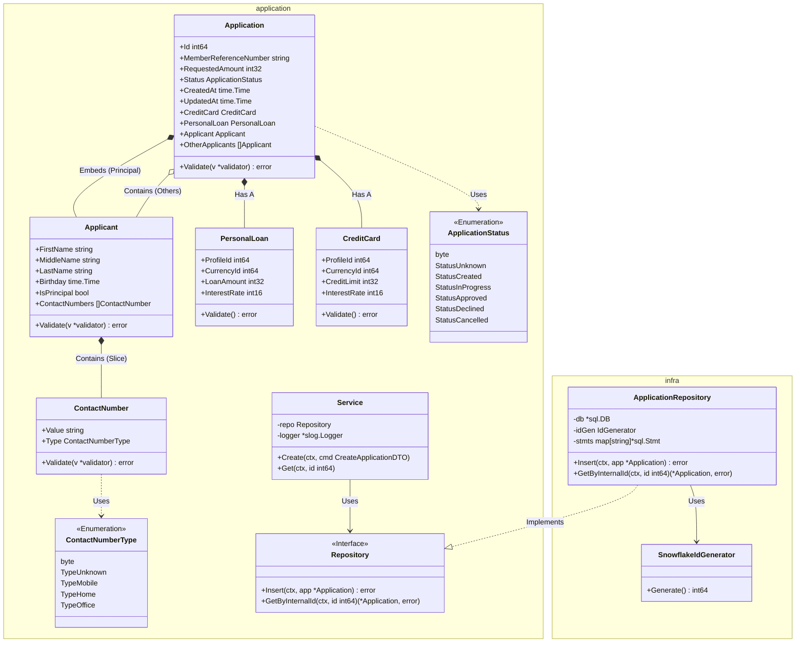
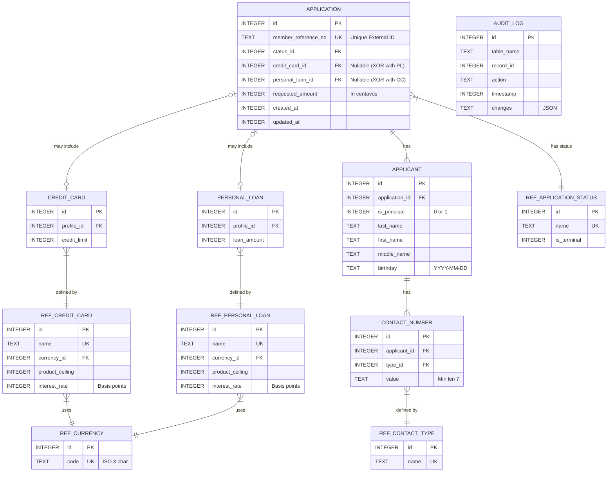

# Black Dog
**Black Dog** is an exercise in building a secure and highly efficient web application using the Go standard library. It is designed to process consumer applications for common retail banking products. Currently, the domain model focuses on credit cards and personal loans but other products are in the immediate roadmap. It employs Domain-Driven Design (DDD) to model the problem space but does not attempt to create microservices in the process. Instead, it aims to deliver the system with a monolithic design and fewer moving parts with the objective of reducing overall system and cognitive complexity.
## Project Structure
```text
blackdog/
├── bin/
│   └── blackdog-web
├── cmd/
│   └── web/ ............................................ (package main)
│       └── main.go
├── data/
│   ├── scripts/
│   │   ├── 01_create_schema.sql
│   │   ├── 02_populate_ref_data.sql
│   │   ├── 03_create_application.sql
│   │   ├── 04_update_application.sql
│   │   ├── 05_bulk_insert_applications.sql
│   │   └── 06_get_applications.sql
│   ├── blackdog.db
│   └── blackdog.db-wal
├── internal/
│   ├── features/
│   │   └── application/ ................................ (package app)
│   │       ├── domain.go
│   │       ├── domain_test.go
│   │       ├── dto.go
│   │       ├── errors.go
│   │       ├── handler.go
│   │       ├── handler_test.go
│   │       ├── middleware.go
│   │       ├── middleware_test.go
│   │       ├── mock_test.go
│   │       ├── repo.go
│   │       ├── service.go
│   │       └── service_test.go
│   └── infra/ .......................................... (package infra)
│       ├── application_repo.go
│       ├── application_repo_test.go
│       ├── id.go
│       ├── id_test.go
│       ├── sqlite_db.go
│       └── sqlite_db_test.go
├── .gitignore
├── go.mod
├── go.sum
├── makefile
└── readme.md
````
## Getting Started
### Prerequisites
- **Go**: Version 1.25.4 or higher
- **SQLite**: Version 3.51.1 or higher
- **Make**: Version 4.4.1 or higher
In terms of tooling, this project relies on standard Go tools for formatting and linting
```shell
go install golang.org/x/tools/cmd/goimports@latest
go install mvdan.cc/gofumpt@latest
go install honnef.co/go/tools/cmd/staticcheck@latest
```
### Installation
1. **Clone the repository:**
```bash
git clone https://github.com/drownedsound/blackdog.git
cd blackdog
```
2. **Build the project:**
Use the provided `makefile` to run static analysis, tests, and compilation in one step.
```bash
make build
```
This command runs `goimports`, `gofumpt`, `staticcheck`, and `go test` before building.

3. **Initialize the database:** For this exercise, SQLite will be used for simlicity and its ubiquity.

```bash
sqlite3 blackdog.db < scripts/01_create_schema.sql
sqlite3 blackdog.db < scripts/02_populate_ref_data.sql
```

### Running the Application
After a successful build, the binary is placed in `bin/blackdog-web`.
```bash
./bin/blackdog-web
```
By default, the server listens on `:4000` and serves static assets from `./ui/static/`.

To invoke the API, `POST localhost:4000/application`, any REST API client can be used.

#### Using cURL
```shell
curl -v -X POST http://localhost:4000/api/application \
  -H "Content-Type: application/json" \
  -d '{
    "member_reference_no": "APP-100",
    "card_profile": 1,
    "requested_amount": 1000000,
    "last_name": "SMITH",
    "first_name": "JOHN",
    "middle_name": "DOE",
    "birthday": "1979-08-30",
    "contact_numbers": [
      {
        "value": "09171234567",
        "type": 1
      },
      {
        "value": "0281234567",
        "type": 3
      }
    ],
    "other_applicants": [
      {
        "first_name": "JANE",
        "last_name": "SMITH",
        "birthday": "1982-05-15",
        "contact_numbers": [
          {
            "value": "09181234567",
            "type": 1
          },
          {
            "value": "0287654321",
            "type": 3
          }
        ]
      },
      {
        "first_name": "JOSEPH",
        "last_name": "SMITH",
        "birthday": "2000-11-20",
        "contact_numbers": [
          {
            "value": "09191234567",
            "type": 1
          },
          {
            "value": "0289876543",
            "type": 3
          }
        ]
      }
    ]
  }'
```

#### Using HTTPie
```shell
http -v POST localhost:4000/api/application \
  member_reference_no=APP-100 \
  card_profile:=1 \
  requested_amount:=1000000 \
  last_name="SMITH" \
  first_name=JOHN \
  middle_name=DOE \
  birthday="1979-08-30" \
  contact_numbers:='[
    {"value": "09171234567", "type": 1}, 
    {"value": "0281234567", "type": 3}
  ]' \
  other_applicants:='[
    {
      "first_name": "JANE", 
      "last_name": "SMITH", 
      "birthday": "1982-05-15", 
      "contact_numbers": [
        {"value": "09181234567", "type": 1}, 
        {"value": "0287654321", "type": 3}
      ]
    },
    {
      "first_name": "JOSEPH", 
      "last_name": "SMITH", 
      "birthday": "2000-11-20", 
      "contact_numbers": [
        {"value": "09191234567", "type": 1}, 
        {"value": "0289876543", "type": 3}
      ]
    }
  ]'
```
### Configuration
The application accepts command-line flags to override default settings:
| Flag | Default | Description |
| :--- | :--- | :--- |
| `-addr` | `:4000` | HTTP network address to listen on. |
| `-static-dir` | `./ui/static/` | Path to the directory containing static assets. |
| `-db-path` | `./data/blackdog.db` | Path to the SQLite database |

**Example:**
```bash
./bin/blackdog-web -addr=":8080" -static-dir="/var/www/blackdog/static" -db-path ./data/blackdog.db
```
## Development
### Running Tests
To run unit tests specifically for the application domain and infrastructure:
```bash
make test
```
This targets `./internal/features/application` and `./internal/infra` with coverage enabled.
### Enforcing Code Quality
Enforce code standards and formatting:
```bash
make staticcheck  # Runs static analysis
make gofumpt      # Enforces stricter formatting
```
### Understanding the Domain Model

The core domain entity is the **Application**, which acts as the Aggregate Root. It manages the state and invariants of:
- **Applicant**: Personal details and contact numers.
- **LoanDetail**: Interest rates and loan amount.
- **CardDetail**: Credit limit and interest rate.
- **Status**: Tracks lifecycle states (e.g., Created, InProgress, Approved).

Current **Status Codes** support the following lifecycle:
`CREATED` -\> `IN_PROGRESS` -\> `APPROVED` | `DECLINED` | `CANCELLED`

### Understanding the Data Model
Below is the current data model used for persistence. The same design will be used when the project is migrated to PostgreSQL from SQLite.


