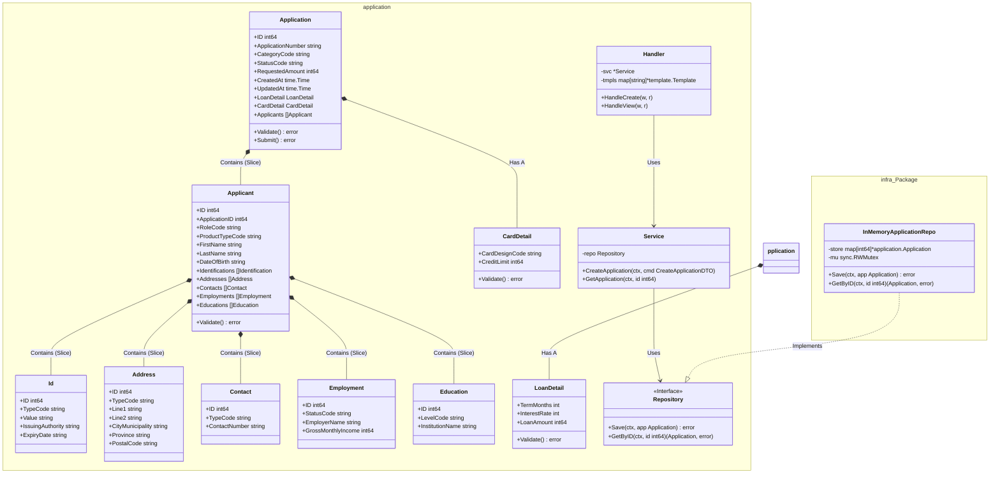

# Black Dog
**Black Dog** is an exercise in building a secure and high-performance web application designed for processing consumer applications for common retail banking products. Currently, the domain model focuses on credit cards and personal loans but other products are in the immediate roadmap. It employs Domain-Driven Design (DDD) to model the problem space but does not attempt to create microservices in the process. Instead, it aims to deliver the system with a monolithic design and fewer moving pieces with the objective of reducing overall system and cognitive complexity.
## Project Structure
```text
blackdog/
├── bin/                 # Compiled binaries
├── cmd/
│   └── web/             # Main entry point (composition root)
├── data/                # Database migration scripts
├── internal/
│   ├── features/        # Feature-based packages 
│   │   └── application/ # Core domain logic 
│   └── infra/           # Infrastructure adapters 
└── ui/                  # Web assets 
````
## Getting Started
### Prerequisites
- **Go**: Version 1.25.4 or higher
- **SQLite**: Version 3.51.1 or higher
- **Make**: For running build automation commands
- **Tooling**: The project relies on standard Go tools for formatting and linting
```shell
go install golang.org/x/tools/cmd/goimports@latest
go install mvdan.cc/gofumpt@latest
go install honnef.co/go/tools/cmd/staticcheck@latest
```
### Installation
1. **Clone the repository:**
```bash
git clone https://github.com/drownedsound/blackdog.git
cd blackdog
```
2. **Build the project:**
Use the provided `makefile` to run static analysis, tests, and compilation in one step.
```bash
make build
```
This command runs `goimports`, `gofumpt`, `staticcheck`, and `go test` before building.

3. **Initialize the database:** For this exercise, SQLite will be used for simlicity and its ubiquity.

```bash
sqlite3 blackdog.db < scripts/01_create_schema.sql
sqlite3 blackdog.db < scripts/02_populate_ref_data.sql
sqlite3 blackdog.db < scripts/03_verify_schema.sql
sqlite3 blackdog.db < scripts/04_create_single_applicant.sql
sqlite3 blackdog.db < scripts/05_create_multi_applicant.sql
sqlite3 blackdog.db < scripts/06_update_applicant.sql
```

### Running the Application
After a successful build, the binary is placed in `bin/blackdog-web`.
```bash
./bin/blackdog-web
```
By default, the server listens on `:4000` and serves static assets from `./ui/static/`.
### Configuration
The application accepts command-line flags to override default settings:
| Flag | Default | Description |
| :--- | :--- | :--- |
| `-addr` | `:4000` | HTTP network address to listen on. |
| `-static-dir` | `./ui/static/` | Path to the directory containing static assets. |

**Example:**
```bash
./bin/blackdog-web -addr=":8080" -static-dir="/var/www/blackdog/static"
```
## Development
### Running Tests
To run unit tests specifically for the application domain and infrastructure:
```bash
make test
```
This targets `./internal/features/application` and `./internal/infra` with coverage enabled.
### Code Quality
Enforce code standards and formatting:
```bash
make staticcheck  # Runs static analysis
make gofumpt      # Enforces stricter formatting
```
### Domain Model

The core domain entity is the **Application**, which acts as the Aggregate Root. It manages the state and invariants of:
- **Applicant**: Personal details, employment, and identification.
- **LoanDetail**: Terms, interest rates, and amounts.
- **CardDetail**: Credit limits and card designs.
- **Status**: Tracks lifecycle states (e.g., Created, InProgress, Approved).

Current **Status Codes** support the following lifecycle:
`CREATED` -\> `IN_PROGRESS` -\> `APPROVED` | `DECLINED` | `CANCELLED`

### Data Model
Below is the current data model used for persistence. The same design will be used when the project is migrated to PostgreSQL from SQLite.

```mermaid
erDiagram
    %% ==========================================
    %% 1. Reference Data (Controlled Vocabulary)
    %% ==========================================
    REF_PRODUCT_CATEGORY {
        text code PK "CARD"
        text description "Credit Card"
    }
    REF_PRODUCT_TYPE {
        text code PK "VISA_GOLD"
        text description "Visa Gold Card"
        text category_code FK "CARD"
    }
    REF_APP_STATUS {
        integer code PK "2"
        text description "Application in review"
        integer is_terminal "0"
    }
    REF_APPLICANT_ROLE {
        text code PK "PRIMARY_CARDHOLDER"
        text description "Main liable party"
        text category_code FK "CARD"
    }
    REF_ADDRESS_TYPE {
        text code PK "RESIDENTIAL"
        text description "Home Address"
    }
    REF_CONTACT_TYPE {
        text code PK "MOBILE"
        text description "Mobile Phone"
    }
    REF_ID_TYPE {
        text code PK "PASSPORT"
        text description "Philippine Passport"
    }
    REF_EMPLOYMENT_STATUS {
        text code PK "REGULAR"
        text description "Regular/Permanent"
    }
    REF_EDUCATION_LEVEL {
        text code PK "COLLEGE"
        text description "Bachelor's Degree"
    }

    %% ==========================================
    %% 2. Transactional Core
    %% ==========================================
    APPLICATION {
        integer id PK "1001"
        text application_number UK "APP-2023-001"
        text category_code FK "CARD"
        integer status_code FK "2"
        integer requested_amount "5000000 (50k PHP)"
        text created_at "2023-10-27T10:00:00Z"
    }

    APPLICANT {
        integer id PK "5001"
        integer application_id FK "1001"
        text role_code FK "PRIMARY_CARDHOLDER"
        text product_type_code FK "VISA_GOLD"
        text first_name "Juan"
        text last_name "Dela Cruz"
        text date_of_birth "1985-05-15"
    }

    %% ==========================================
    %% 3. Applicant Identity (New Table)
    %% ==========================================
    APPLICANT_IDENTIFICATION {
        integer id PK "4001"
        integer applicant_id FK "5001"
        text id_type_code FK "PASSPORT"
        text id_value "P1234567A"
        text issuing_authority "DFA"
        text expiry_date "2028-05-15"
    }

    %% ==========================================
    %% 4. Product Specifics (Polymorphic)
    %% ==========================================
    LOAN_DETAIL {
        integer application_id PK, FK "1002"
        integer term_months "36"
        integer interest_rate "89 (0.89%)"
        integer loan_amount "5000000 (50k PHP)"
    }
    CARD_DETAIL {
        integer application_id PK, FK "1001"
        text card_design_code "STD_BLUE"
        integer credit_limit "10000000 (100k PHP)"
    }

    %% ==========================================
    %% 5. Transactional Details (Applicant)
    %% ==========================================
    APPLICANT_ADDRESS {
        integer id PK "8001"
        integer applicant_id FK "5001"
        text address_type_code FK "RESIDENTIAL"
        text line_1 "Unit 404, Building A"
        text line_2 "Rizal Avenue, Brgy 678"
        text city_municipality "Manila"
        text province "Metro Manila"
        text postal_code "1000"
    }
    APPLICANT_CONTACT {
        integer id PK "9001"
        integer applicant_id FK "5001"
        text contact_type_code FK "MOBILE"
        text contact_number "+639171234567"
    }
    APPLICANT_EMPLOYMENT {
        integer id PK "7001"
        integer applicant_id FK "5001"
        text employment_status_code FK "REGULAR"
        text employer_name "Acme Corp"
        integer gross_monthly_income "5000000 (50k PHP)"
    }
    APPLICANT_EDUCATION {
        integer id PK "6001"
        integer applicant_id FK "5001"
        text education_level_code FK "COLLEGE"
        text institution_name "UP Diliman"
    }

    %% ==========================================
    %% 6. Audit Trail
    %% ==========================================
    AUDIT_LOG {
        integer id PK "999"
        text table_name "APPLICATION"
        integer record_id "1001"
        text action "UPDATE"
        text old_value "{status: 1}"
        text new_value "{status: 2}"
        text changed_at "2023-10-27T10:05:00Z"
    }

    %% ==========================================
    %% Relationships
    %% ==========================================
    
    REF_PRODUCT_CATEGORY ||--o{ REF_PRODUCT_TYPE : classifies
    REF_PRODUCT_CATEGORY ||--o{ APPLICATION : defines
    REF_PRODUCT_CATEGORY ||--o{ REF_APPLICANT_ROLE : scopes
    REF_APP_STATUS ||--o{ APPLICATION : tracks
    
    APPLICATION ||--|{ APPLICANT : contains
    REF_PRODUCT_TYPE ||--o{ APPLICANT : requested_by
    REF_APPLICANT_ROLE ||--o{ APPLICANT : defines_liability

    APPLICATION ||--o| LOAN_DETAIL : holds
    APPLICATION ||--o| CARD_DETAIL : holds

    APPLICANT ||--|{ APPLICANT_IDENTIFICATION : identified_by
    REF_ID_TYPE ||--o{ APPLICANT_IDENTIFICATION : describes

    APPLICANT ||--|{ APPLICANT_ADDRESS : lives_at
    REF_ADDRESS_TYPE ||--o{ APPLICANT_ADDRESS : describes

    APPLICANT ||--|{ APPLICANT_CONTACT : reachable_via
    REF_CONTACT_TYPE ||--o{ APPLICANT_CONTACT : describes

    APPLICANT ||--|{ APPLICANT_EMPLOYMENT : employed_as
    REF_EMPLOYMENT_STATUS ||--o{ APPLICANT_EMPLOYMENT : describes

    APPLICANT ||--|{ APPLICANT_EDUCATION : educated_at
    REF_EDUCATION_LEVEL ||--o{ APPLICANT_EDUCATION : describes
```


