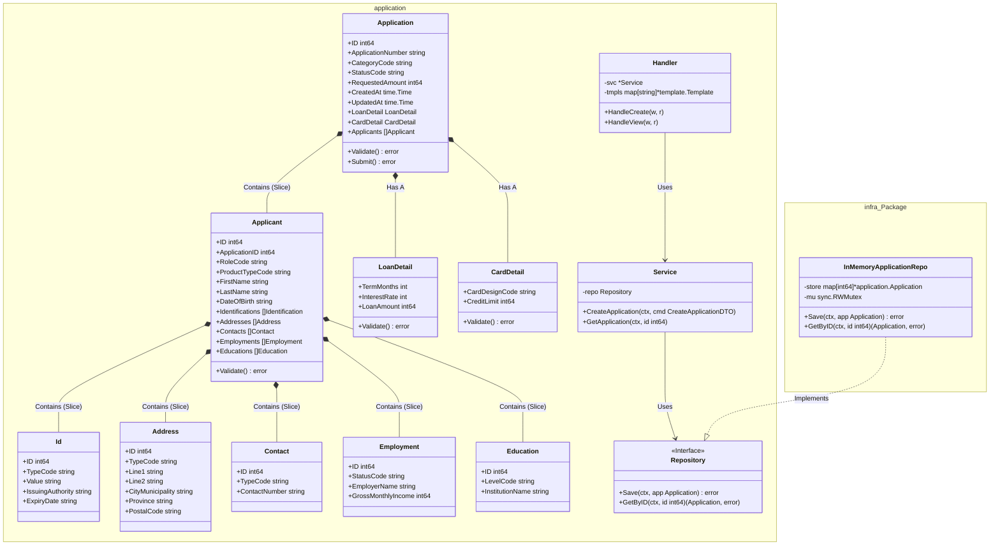

# Black Dog
## Directory Structure
```mermaid
blackdog/
├── .gitignore                   
├── go.mod                       
├── makefile                     
├── readme.md                    
├── bin/
│   └── blackdog-web             
├── cmd/
│   └── web/
│       └── main.go              # PACKAGE: main (Composition Root)
├── data/
│   ├── blackdog.db              # SQLite Database
│   └── scripts/                 # Database Migration Scripts
├── internal/
│   ├── features/
│   │   └── application/         # PACKAGE: application (Vertical Slice)
│   │       ├── models.go        # Domain Entities
│   │       ├── repository.go    # Repository Interface (Port)
│   │       ├── service.go       # Application Logic (Use Cases)
│   │       ├── handlers.go      # HTTP Handlers (Adapter)
│   │       └── dtos.go          # DTOs
│   └── infra/                   # PACKAGE: infra
│       └── memory_repo.go       # In-Memory Database (Adapter)
└── ui/
    ├── html/                    # Templates
    │   ├── base.tmpl            
    │   ├── pages/
    │   └── partials/
    └── static/                  # Assets
        ├── css/
        └── js/
```
## Module Packages


